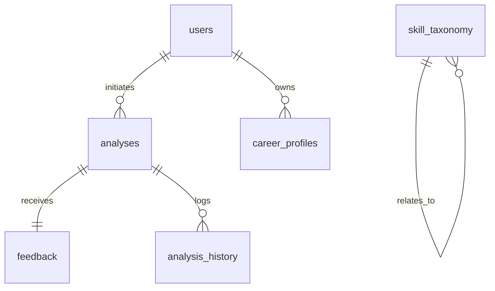

# NeuroSync Database Schema Blueprint

**Target Database**: PostgreSQL (v15+)  
**Object-Relational Mapping (ORM)**: SQLAlchemy (v2.0) / SQLModel  
**Status**: DESIGN (Pending Implementation)

---

## 1. Entity Relationship Overview



---

## 2. Table Specifications

### 2.1 users

Stores the central user accounts and authentication credentials.

```sql
CREATE TABLE users (
    id UUID PRIMARY KEY DEFAULT gen_random_uuid(),
    email VARCHAR(255) UNIQUE NOT NULL,
    password_hash VARCHAR(255) NOT NULL,
    first_name VARCHAR(100),
    last_name VARCHAR(100),
    is_active BOOLEAN DEFAULT TRUE NOT NULL,
    is_superuser BOOLEAN DEFAULT FALSE NOT NULL,
    created_at TIMESTAMP WITH TIME ZONE DEFAULT CURRENT_TIMESTAMP NOT NULL,
    updated_at TIMESTAMP WITH TIME ZONE DEFAULT CURRENT_TIMESTAMP NOT NULL
);

CREATE INDEX idx_users_email ON users(email);
```

### 2.2 career_profiles

Stores user-specific career states, current resumes, and target domains.

```sql
CREATE TABLE career_profiles (
    id UUID PRIMARY KEY DEFAULT gen_random_uuid(),
    user_id UUID NOT NULL REFERENCES users(id) ON DELETE CASCADE,
    title VARCHAR(150),
    raw_resume_text TEXT,
    skills_json JSONB DEFAULT '[]'::jsonb NOT NULL, -- list of canonical skill strings
    target_role VARCHAR(150),
    experience_years NUMERIC(4,2),
    created_at TIMESTAMP WITH TIME ZONE DEFAULT CURRENT_TIMESTAMP NOT NULL,
    updated_at TIMESTAMP WITH TIME ZONE DEFAULT CURRENT_TIMESTAMP NOT NULL
);

CREATE INDEX idx_career_profiles_user ON career_profiles(user_id);
CREATE INDEX idx_career_profiles_skills ON career_profiles USING gin (skills_json);
```

### 2.3 skill_taxonomy

Acts as the persistent storage of the skill graph, replacing the static `skill_taxonomy.json` file.

```sql
CREATE TABLE skill_taxonomy (
    id VARCHAR(100) PRIMARY KEY, -- lowercased canonical key (e.g. 'pytorch')
    canonical VARCHAR(150) NOT NULL UNIQUE, -- display name (e.g. 'PyTorch')
    category VARCHAR(50) NOT NULL, -- e.g. 'ml_ai', 'programming'
    importance_weight NUMERIC(3,2) DEFAULT 0.50 NOT NULL, -- 0.0 - 1.0
    aliases JSONB DEFAULT '[]'::jsonb NOT NULL, -- string array of alternative names
    related JSONB DEFAULT '[]'::jsonb NOT NULL, -- string array of related skill keys
    is_discovered BOOLEAN DEFAULT FALSE NOT NULL, -- true if added by discovery pipeline
    created_at TIMESTAMP WITH TIME ZONE DEFAULT CURRENT_TIMESTAMP NOT NULL,
    updated_at TIMESTAMP WITH TIME ZONE DEFAULT CURRENT_TIMESTAMP NOT NULL
);

CREATE INDEX idx_skill_taxonomy_category ON skill_taxonomy(category);
CREATE INDEX idx_skill_taxonomy_aliases ON skill_taxonomy USING gin (aliases);
```

### 2.4 analyses

Stores the results of running the resume-to-JD analysis engine.

```sql
CREATE TABLE analyses (
    id UUID PRIMARY KEY DEFAULT gen_random_uuid(),
    user_id UUID REFERENCES users(id) ON DELETE SET NULL, -- Nullable for guest scans
    resume_text TEXT NOT NULL,
    jd_text TEXT NOT NULL,

    -- Overall Decision
    recommendation VARCHAR(50) NOT NULL, -- apply_with_preparation, etc.
    fit_level VARCHAR(50) NOT NULL, -- good_fit, etc.
    overall_score NUMERIC(5,2) NOT NULL, -- 0.0 - 100.0
    shortlist_probability NUMERIC(4,3) NOT NULL, -- 0.0 - 1.0
    confidence NUMERIC(4,3) NOT NULL, -- 0.0 - 1.0
    reasoning TEXT NOT NULL,

    -- Scoring Component Details
    semantic_score NUMERIC(4,3),
    skill_overlap_score NUMERIC(4,3) NOT NULL,
    gap_penalty NUMERIC(4,3) NOT NULL,
    scoring_explanation TEXT,

    -- Raw Outputs (for schema safety and auditability)
    extracted_skills JSONB NOT NULL, -- Full matched skill details
    detected_gaps JSONB NOT NULL, -- Gaps with priorities and learning paths
    simulations JSONB DEFAULT '[]'::jsonb NOT NULL,

    processing_time_ms INT NOT NULL,
    created_at TIMESTAMP WITH TIME ZONE DEFAULT CURRENT_TIMESTAMP NOT NULL
);

CREATE INDEX idx_analyses_user ON analyses(user_id);
CREATE INDEX idx_analyses_score ON analyses(overall_score);
```

### 2.5 feedback

Stores hiring outcome feedback and corrections recorded by users.

```sql
CREATE TABLE feedback (
    id UUID PRIMARY KEY DEFAULT gen_random_uuid(),
    analysis_id UUID NOT NULL UNIQUE REFERENCES analyses(id) ON DELETE CASCADE,
    outcome VARCHAR(50) NOT NULL, -- hired, rejected, interview, ghosted, user_disagrees
    user_notes TEXT,
    is_processed BOOLEAN DEFAULT FALSE NOT NULL, -- mark true once weight tuner recalibrates
    created_at TIMESTAMP WITH TIME ZONE DEFAULT CURRENT_TIMESTAMP NOT NULL
);

CREATE INDEX idx_feedback_outcome ON feedback(outcome);
CREATE INDEX idx_feedback_unprocessed ON feedback(is_processed) WHERE is_processed = FALSE;
```

### 2.6 analysis_history

Maintains historical logs of scores, modifications, and user iterations over time.

```sql
CREATE TABLE analysis_history (
    id UUID PRIMARY KEY DEFAULT gen_random_uuid(),
    user_id UUID NOT NULL REFERENCES users(id) ON DELETE CASCADE,
    analysis_id UUID NOT NULL REFERENCES analyses(id) ON DELETE CASCADE,
    target_role VARCHAR(150) NOT NULL,
    fit_score NUMERIC(5,2) NOT NULL,
    skills_added JSONB DEFAULT '[]'::jsonb NOT NULL, -- skills learned/added since previous run
    notes TEXT,
    created_at TIMESTAMP WITH TIME ZONE DEFAULT CURRENT_TIMESTAMP NOT NULL
);

CREATE INDEX idx_analysis_history_user ON analysis_history(user_id);
CREATE INDEX idx_analysis_history_date ON analysis_history(created_at DESC);
```

---

## 3. Human State Intelligence Tables (Phase 2+) ★ NEW

> These tables support the Human State Intelligence layer.
> Camera signals are optional — no raw video is ever stored.

### 3.1 agent_observations

The agent memory layer. Every signal from every source is recorded here.

```sql
CREATE TABLE agent_observations (
    id UUID PRIMARY KEY DEFAULT gen_random_uuid(),
    user_id UUID NOT NULL REFERENCES users(id) ON DELETE CASCADE,
    source VARCHAR(20) NOT NULL,          -- ObservationSource enum
    signal VARCHAR(100) NOT NULL,         -- e.g., 'engagement_low', 'completion_drop'
    confidence NUMERIC(4,3) NOT NULL,     -- 0.0 - 1.0
    raw_data JSONB,                       -- Optional metadata (NEVER raw video/images)
    created_at TIMESTAMP WITH TIME ZONE DEFAULT CURRENT_TIMESTAMP NOT NULL
);

CREATE INDEX idx_agent_obs_user ON agent_observations(user_id);
CREATE INDEX idx_agent_obs_source ON agent_observations(source);
CREATE INDEX idx_agent_obs_date ON agent_observations(created_at DESC);

-- Constraint: camera source must never store raw image data
-- Enforced at application layer
```

### 3.2 career_state

The unified state representation. Agent decisions consume this — never raw signals.

```sql
CREATE TABLE career_state (
    id UUID PRIMARY KEY DEFAULT gen_random_uuid(),
    user_id UUID NOT NULL UNIQUE REFERENCES users(id) ON DELETE CASCADE,
    confidence_score NUMERIC(4,3) NOT NULL DEFAULT 0.5,
    momentum_score NUMERIC(4,3) NOT NULL DEFAULT 0.5,
    engagement_score NUMERIC(4,3) NOT NULL DEFAULT 0.5,
    consistency_score NUMERIC(4,3) NOT NULL DEFAULT 0.5,
    growth_velocity NUMERIC(6,2) NOT NULL DEFAULT 0.0,
    burnout_risk NUMERIC(4,3) NOT NULL DEFAULT 0.0,
    interview_readiness NUMERIC(4,3) NOT NULL DEFAULT 0.0,
    career_readiness NUMERIC(4,3) NOT NULL DEFAULT 0.0,
    updated_at TIMESTAMP WITH TIME ZONE DEFAULT CURRENT_TIMESTAMP NOT NULL
);

CREATE INDEX idx_career_state_user ON career_state(user_id);
```

### 3.3 learning_sessions

Tracks learning activity for engagement and consistency computation.

```sql
CREATE TABLE learning_sessions (
    id UUID PRIMARY KEY DEFAULT gen_random_uuid(),
    user_id UUID NOT NULL REFERENCES users(id) ON DELETE CASCADE,
    roadmap_id UUID,                      -- Nullable (freeform sessions)
    skill_focus VARCHAR(150) NOT NULL,    -- Canonical skill being studied
    duration_minutes INT,
    completion_rate NUMERIC(4,3),         -- 0.0 - 1.0
    engagement_score NUMERIC(4,3),        -- 0.0 - 1.0 (derived)
    abandoned BOOLEAN DEFAULT FALSE NOT NULL,
    started_at TIMESTAMP WITH TIME ZONE DEFAULT CURRENT_TIMESTAMP NOT NULL,
    ended_at TIMESTAMP WITH TIME ZONE
);

CREATE INDEX idx_learning_sessions_user ON learning_sessions(user_id);
CREATE INDEX idx_learning_sessions_date ON learning_sessions(started_at DESC);
CREATE INDEX idx_learning_sessions_skill ON learning_sessions(skill_focus);
```

### 3.4 state_transitions

Agent memory of growth — tracks before/after state changes with reasoning.

```sql
CREATE TABLE state_transitions (
    id UUID PRIMARY KEY DEFAULT gen_random_uuid(),
    user_id UUID NOT NULL REFERENCES users(id) ON DELETE CASCADE,
    previous_state JSONB NOT NULL,        -- Full CareerState snapshot (before)
    new_state JSONB NOT NULL,             -- Full CareerState snapshot (after)
    reason TEXT NOT NULL,                 -- "Engagement dropped 60% over 3 days"
    triggered_actions JSONB DEFAULT '[]'::jsonb NOT NULL,  -- ["pause_roadmap"]
    created_at TIMESTAMP WITH TIME ZONE DEFAULT CURRENT_TIMESTAMP NOT NULL
);

CREATE INDEX idx_state_transitions_user ON state_transitions(user_id);
CREATE INDEX idx_state_transitions_date ON state_transitions(created_at DESC);
```

---

## 4. Database Migration Strategy

1. **Alembic integration** will be set up in `core/backend/` to track and apply structural alterations.
2. **Taxonomy Seed Data**: A Python migration script will read the local `skill_taxonomy.json` file and seed the `skill_taxonomy` table during initial setup.
3. **Foreign Key Integrity**: Cascade options are explicitly declared (`ON DELETE CASCADE` for user ownership, `SET NULL` for loose linkages like guest analyses).
4. **Phase 2+ Tables**: Human State Intelligence tables (`agent_observations`, `career_state`, `learning_sessions`, `state_transitions`) will be added via Alembic migration when the behavioral layer is implemented.
